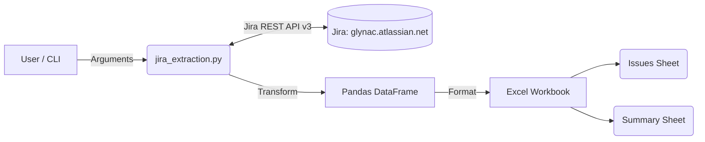

# Jira Extraction Application – Deployment & Testing Guide

## 1. Overview and Purpose
The Jira Extraction Application extracts issue data and metadata from Jira instances via the Jira REST API v3 (specifically targeting `https://glynac.atlassian.net`). It transforms the extracted data into structured Pandas DataFrames and generates highly formatted, multi-sheet Excel reports containing both issue details and summary analytics.

## 2. Architecture



## 3. Prerequisites
- **Python**: 3.12 or higher
- **Docker**: 29.x or higher
- **Git**: For version control and deployment scripts
- **Nomad**: (Optional) For scheduled batch deployment
- **Atlassian API Token**: A valid Jira API token with read permissions for the target project.

## 4. Environment Setup
1. Clone the repository and navigate to the application directory.
2. Create a virtual environment: `python -m venv venv`
3. Activate the environment:
   - Windows: `.\venv\Scripts\activate`
   - Linux/macOS: `source venv/bin/activate`
4. Install dependencies: `pip install -r requirements.txt`
5. Configure `.env` file based on `.env.example`:
   ```env
   JIRA_URL=https://glynac.atlassian.net
   JIRA_USER=your_email@example.com
   JIRA_API_TOKEN=your_token_here
   ```

## 5. Docker Deployment
The application is fully containerized using a hardened image.
- **Dockerfile**: Built on `python:3.12-slim`, configures a non-root `appuser`, installs only necessary packages, and sets a volume `/app/output` for the generated Excel reports.
- **docker-compose**: Use `docker-compose up` to run the application securely. 
  ```yaml
  version: '3.8'
  services:
    jira-extractor:
      build: .
      env_file: .env
      volumes:
        - ./output:/app/output
      user: "1000:1000"
  ```

## 6. Nomad Periodic Batch Deployment
To run the extraction automatically, use HashiCorp Nomad.
- **Job File**: `nomad/jira-extraction.nomad`
- **Schedule**: Daily cron at `06:00 UTC`
- **Secrets**: Consul KV secret injection for credentials.
- **Storage**: Host volume persistence for generated reports.

## 7. Deployment Scripts
Automate deployment and execution across platforms:
- **Windows**: `deploy.ps1` - Automates venv setup, dependency installation, credential validation, and execution.
- **Linux/macOS**: `deploy.sh` - Bash equivalent for Unix systems.

## 8. Automated Testing Procedures
Run the test suite using `run_tests.py`. The suite (`tests/test_jira_extraction.py`) covers 8 categories:
1. **Config**: Environment variable validation.
2. **Credentials**: API token formatting.
3. **Data Transforms**: Flattening custom fields and nested JSON.
4. **Sprint Extraction**: Parsing agile board details.
5. **Proxy Objects**: Testing mock responses.
6. **DataFrame Schema**: Column validation and types.
7. **Excel Generation**: OpenPyXL formatting and sheet creation.
8. **API Error Handling**: HTTP 401/404 handling.
9. **CLI Parsing**: Argument validation.
10. **Live Integration**: E2E smoke tests.
11. **Project Structure**: Ensuring deployment files exist.

## 9. Usage Examples
- **Default**: `python jira_extraction.py`
- **Custom JQL**: `python jira_extraction.py --jql "project = DEV AND status = 'In Progress'"`
- **Templates**: `python jira_extraction.py --template open_bugs`
- **Limit**: `python jira_extraction.py --limit 50`
- **Output**: `python jira_extraction.py --output reports/weekly_status.xlsx`

## 10. Troubleshooting Guide
- **401 Unauthorized**: Ensure `JIRA_API_TOKEN` is correct and associated with the `JIRA_USER` email.
- **404 Not Found**: Verify `JIRA_URL` is correct (`https://glynac.atlassian.net`) and the project exists.
- **JQL Syntax**: If query fails, ensure quotes are correctly escaped and field names are valid in Jira.
- **ModuleNotFoundError**: Ensure the virtual environment is activated and `pip install -r requirements.txt` was run.
- **Excel won't open**: Ensure no other program is locking the file if regenerating, or check volume mounts in Docker.

## 11. Project Structure
```text
.
├── .env
├── .env.example
├── Dockerfile
├── docker-compose.yml
├── deploy.ps1
├── deploy.sh
├── generate_docx.py
├── JIRA_EXTRACTION_DEPLOYMENT_AND_TESTING_GUIDE.md
├── jira_extraction.py
├── requirements.txt
├── run_tests.py
├── nomad/
│   └── jira-extraction.nomad
├── tests/
│   └── test_jira_extraction.py
└── output/
```
