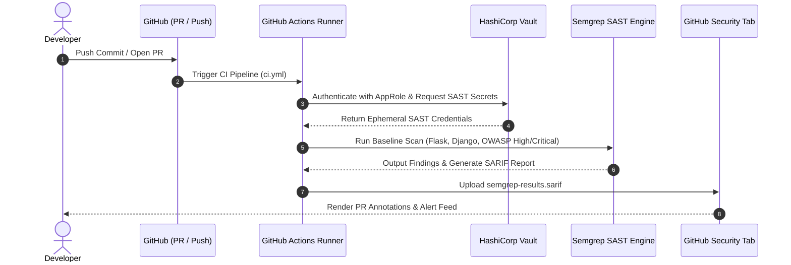

# SAST Pipeline Integration & Validation Task

## Overview
This task validates and integrates **Static Application Security Testing (SAST)** into the CI/CD pipeline. The implementation focuses on rapid scan execution, high-accuracy detection for **Flask** and **Django** applications, non-intrusive developer experience, and secure credential handling via **HashiCorp Vault**.

---

## Included Files & Structure

```
tasks/sast_pipeline_validation/
├── README.md                     # Comprehensive task overview and guide
├── SAST_EVALUATION_REPORT.md      # Detailed PoC evaluation, benchmarks & metrics
├── .semgrep.yml                   # Baseline High & Critical security rules (Flask/Django/Secrets)
├── vault_sast_policy.hcl          # Vault ACL policy for CI/CD SAST reader role
└── vault_setup.sh                 # Automation script to configure Vault KV & AppRole

sample_backend/
├── app_flask.py                   # Flask test app with secure and vulnerable endpoints
├── views_django.py                # Django test views with secure and vulnerable queries
└── requirements.txt               # Backend dependencies

.github/workflows/ci.yml           # Updated CI pipeline with sast-security-scan job
.semgrepignore                     # Ignore patterns to suppress noise and optimize scan speed
```

---

## Key Features Implemented

1. **Framework-Aware Security Analysis:**
   - **Flask:** Detects unparameterized SQL queries, SSTI in `render_template_string`, and dangerous debug flags.
   - **Django:** Detects raw SQL string formatting, missing CSRF exemptions without token checks, and unvalidated inputs.
   - **Secrets & Injection:** Scans for hardcoded credentials, API keys, and OWASP Top 10 vulnerabilities.

2. **High & Critical Baseline Filtering:**
   - Rule configurations are scoped strictly to `ERROR` and high-confidence patterns to eliminate low-priority noise and prevent alert fatigue.

3. **Secure Vault Credential Integration:**
   - CI runner authenticates to HashiCorp Vault via AppRole to fetch ephemeral SAST tokens.
   - No static API keys or credentials stored in repository code.

4. **SARIF Code Scanning Dashboard:**
   - Results are formatted in SARIF (`semgrep-results.sarif`) and uploaded directly to GitHub Actions Security tab, providing inline annotations on Pull Requests.

---

## Local Verification & Execution

### 1. Run Baseline SAST Scan
```bash
# Run Semgrep with local baseline rules
semgrep scan --config=tasks/sast_pipeline_validation/.semgrep.yml sample_backend/

# Run Bandit for Python AST security analysis
bandit -r sample_backend/ -ll -iii
```

### 2. Configure HashiCorp Vault Secrets
```bash
chmod +x tasks/sast_pipeline_validation/vault_setup.sh
./tasks/sast_pipeline_validation/vault_setup.sh
```

---

## CI/CD Pipeline Workflow


