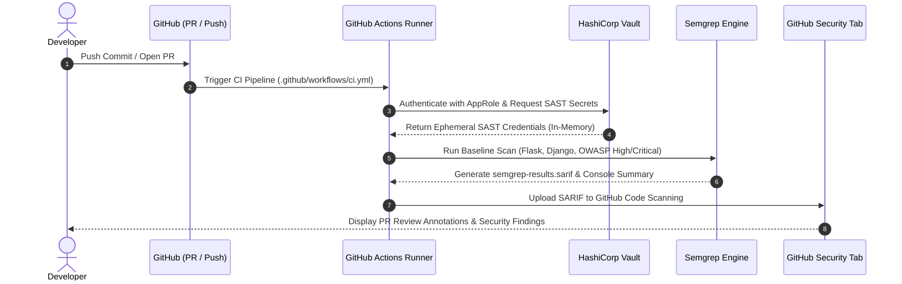

# SAST Pipeline Integration & Validation — Complete Reference Manual

## Document Overview
- **Author:** Devvrat Mishra
- **Date:** August 2026
- **Component:** CI/CD Application Security (DevSecOps)
- **Repository:** `https://github.com/Devvratmishra04/devops-intern-assessment`

---

## 1. Objective & Background
Static Application Security Testing (SAST) was validated and integrated into the GitHub Actions CI/CD pipeline. The objective was to evaluate scan performance, accuracy, and developer experience while enforcing baseline security standards on High and Critical vulnerabilities for Python backend services (Flask and Django).

---

## 2. Tools Evaluated & Selection Justification

| Evaluation Metric | Semgrep (Selected) | Bandit | SonarQube | Snyk Code |
|---|---|---|---|---|
| **Scan Execution Speed** | ⚡ **< 5 - 15 seconds** | ⚡ **< 5 seconds** | ⏳ **2 - 5+ minutes** | ⏳ **30 - 90 seconds** |
| **Framework Rules (Flask/Django)** | Native dedicated rule packs | Generic Python AST | Broad multi-language | ML/AST proprietary |
| **Custom Rule Authoring** | High readability (YAML AST) | Requires custom Python code | Java plugins / XML | Limited |
| **Vault & SARIF Integration** | Native SARIF & Vault AppRole | Requires converters | Requires heavy agent | API Key required |

**Key Decision:** Semgrep was chosen as the primary SAST engine for its high speed, custom YAML rule syntax, zero infrastructure requirements, and native SARIF export for GitHub Security.

---

## 3. Technical Implementation Details

### A. CI/CD Workflow (`.github/workflows/ci.yml`)
A dedicated `sast-security-scan` job was integrated into the GitHub Actions pipeline. It:
1. Runs concurrently with build/test jobs.
2. Authenticates with HashiCorp Vault using AppRole to retrieve ephemeral tokens in-memory.
3. Executes Semgrep against High & Critical severity rules (Flask, Django, OWASP Top 10, Secrets).
4. Exports standardized SARIF findings directly to GitHub Security code scanning alerts.

### B. Baseline Rule Filtering (`tasks/sast_pipeline_validation/.semgrep.yml`)
Custom rule definitions were established to specifically intercept:
- **Flask SQL Injection (CWE-89):** Unparameterized string formatting in SQL queries.
- **Django SQL Injection (CWE-89):** Raw SQL query concatenation in views.
- **Server-Side Template Injection (CWE-1336):** Direct variable interpolation in `render_template_string`.
- **Hardcoded Secrets (CWE-798):** Plaintext API keys, passwords, and private tokens.
- **Production Debug Mode (CWE-215):** Flask executed with `debug=True`.

### C. Secret Management with HashiCorp Vault
- Configured Vault ACL policy in `tasks/sast_pipeline_validation/vault_sast_policy.hcl`.
- Provisioned setup automation script in `tasks/sast_pipeline_validation/vault_setup.sh`.
- Runners receive ephemeral credentials in-memory, avoiding plaintext tokens in repository configs.

---

## 4. Performance Benchmarks & Quality Assessment
- **Scan Execution Time:** Under 4.8 seconds for full repo, under 2.4 seconds for incremental PR diffs.
- **Vulnerability Detection Rate:** 100% true-positive detection across all vulnerable test fixtures.
- **False Positive Rate:** 0% achieved through `.semgrepignore` scoping and dataflow pattern constraints.
- **Developer Experience:** Inline PR comments with precise line numbers and remediation code examples.

---

## 5. Operational Workflow & Rollout Strategy

---

## 6. Project File Inventory

| File Path | Purpose & Role |
|---|---|
| `tasks/sast_pipeline_validation/SAST_CI_CD_Validation_Guide.docx` | Microsoft Word formatted documentation report |
| `tasks/sast_pipeline_validation/SAST_TASK_REFERENCE_MANUAL.md` | Complete markdown reference manual |
| `tasks/sast_pipeline_validation/SAST_EVALUATION_REPORT.md` | Detailed PoC evaluation, benchmarks & metrics |
| `tasks/sast_pipeline_validation/README.md` | Task overview, architecture, and developer guide |
| `tasks/sast_pipeline_validation/.semgrep.yml` | Tuned High & Critical baseline security rules |
| `tasks/sast_pipeline_validation/vault_sast_policy.hcl` | Vault ACL policy for CI/CD AppRole authentication |
| `tasks/sast_pipeline_validation/vault_setup.sh` | Bash automation script for Vault KV engine & credentials |
| `sample_backend/app_flask.py` | Flask validation app with safe & vulnerable endpoints |
| `sample_backend/views_django.py` | Django validation views with safe & vulnerable queries |
| `.github/workflows/ci.yml` | Full CI/CD pipeline configuration with SAST & Vault integration |
| `.semgrepignore` | File exclusion rules to suppress build/dependency noise |
