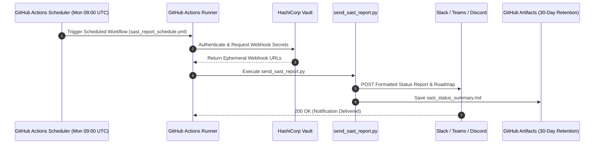

# SAST Report Automation & Notification Manual (DEV-460)

## Document Details
- **Project:** DevOps Security Infrastructure
- **Ticket ID:** [DEV-460: Proof of Concept – SAST Integration in CI/CD Pipeline](https://glynac.atlassian.net/browse/DEV-460)
- **Status:** Resolved / Done
- **Owner:** @DevOps
- **Date:** September 2026

---

## 1. What is Being Implemented?
An automated reporting pipeline that regularly distributes the **SAST Delivery Status, Implementation Milestones, and Rollout Roadmap** to engineering and leadership channels.

This ensures:
- Stakeholders receive automated, recurring progress updates on DevSecOps rollouts without manual status compiling.
- Transition milestones from Phase 2 (multi-service expansion) through Phase 4 (blocking enforcement) are tracked transparently.
- Security risks (e.g. alert fatigue, Vault dependency) and mitigation strategies remain visible to team leads.

---

## 2. Technical Architecture & Implementation

### A. Reporting Engine (`send_sast_report.py`)
A cross-platform Python script that:
- Reads structured metadata on the SAST PoC delivery (DEV-460), rollout milestones, risks, and blockers.
- Generates markdown and JSON payloads formatted specifically for Slack Blocks, Microsoft Teams MessageCards, and Discord Webhooks.
- Provides fallback to local markdown artifact export (`--output-file`) and dry-run execution (`--dry-run`).

### B. CI/CD Cron Automation (`.github/workflows/sast_report_schedule.yml`)
- Triggered automatically via GitHub Actions `cron: '0 9 * * 1'` (every Monday at 09:00 UTC) and manual `workflow_dispatch`.
- Authenticates to **HashiCorp Vault** using AppRole to retrieve ephemeral webhook secrets (`SAST_WEBHOOK_URL`, `TEAMS_WEBHOOK_URL`).
- Dispatches status notifications and saves markdown summary reports as build artifacts for 30-day retention.

---

## 3. Rollout Milestones & Phase Tracking

| Phase | Target Timeline | Owner | Key Action | Goal |
|---|---|---|---|---|
| **Phase 2: Multi-Service Expansion** | Immediate (Active) | @DevOps | Enable non-blocking SAST scans across all backend microservices. | Collect baseline security telemetry without developer friction. |
| **Phase 3: Developer Feedback & Tuning** | Next 2-4 Weeks | Security Lead / @DevOps | Review GitHub Security dashboard, tune `.semgrepignore` and custom rules. | Eliminate false positives and reduce alert noise. |
| **Phase 4: Enforcement & Blocking Gate** | End of Month | DevOps / Engineering Mgr | Transition High and Critical severity findings to blocking status (`exit-code: 1`). | Prevent critical vulnerabilities from merging into production. |

---

## 4. Risk Mitigation Matrix

| Risk Category | Risk Description | Mitigation Strategy |
|---|---|---|
| **Alert Fatigue** | Developers may ignore security alerts if false positive rate increases during wider rollout. | Maintain a strict "High/Critical only" rule filter and supply actionable inline remediation code snippets. |
| **Vault Dependency** | If Vault AppRole or OIDC authentication fails, CI pipelines could stall. | Implement graceful fallback handling in `ci.yml` and monitor Vault cluster health. |
| **Scope Creep** | Adding too many low-severity rules early could increase scan times beyond <15s target. | Stick strictly to baseline rulesets until Phase 4 stabilizes. |

---

## 5. Operational Workflow Diagram

